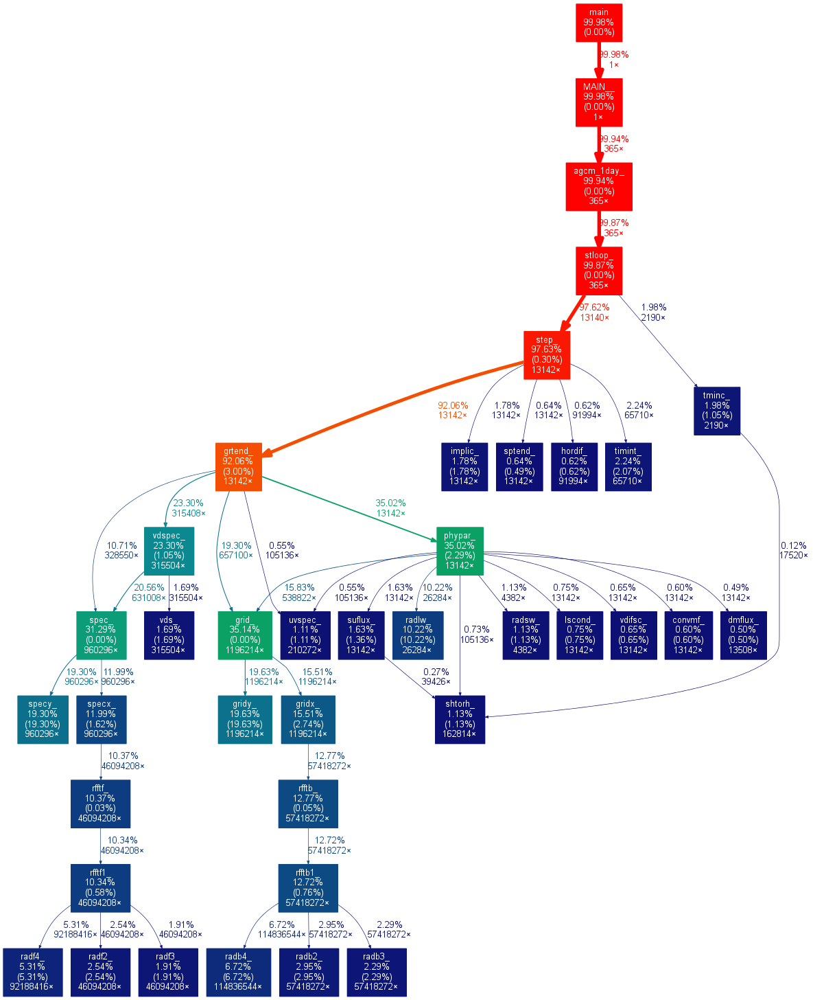

SPEEDY-F90
==========

[SPEEDY](http://users.ictp.it/~kucharsk/speedy-net.html) is an intermediate complexity pseudo-spectral atmospheric general circulation model, developed by Fred Kucharski, Franco Molteni and Martin P. King. This repository contains version 41 of SPEEDY, but (mostly) updated to the FORTRAN 90 standard. This is in order to, eventually, integrate a [reduced precision emulator](https://github.com/aopp-pred/rpe).

